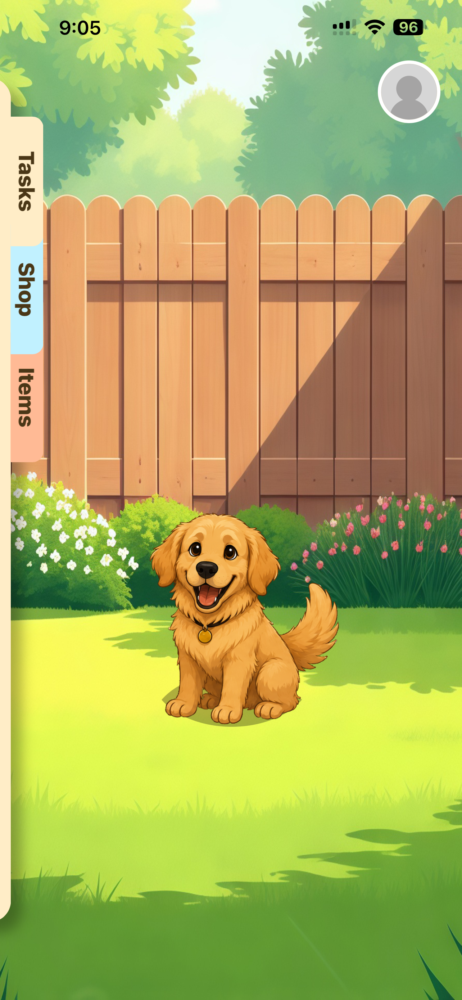
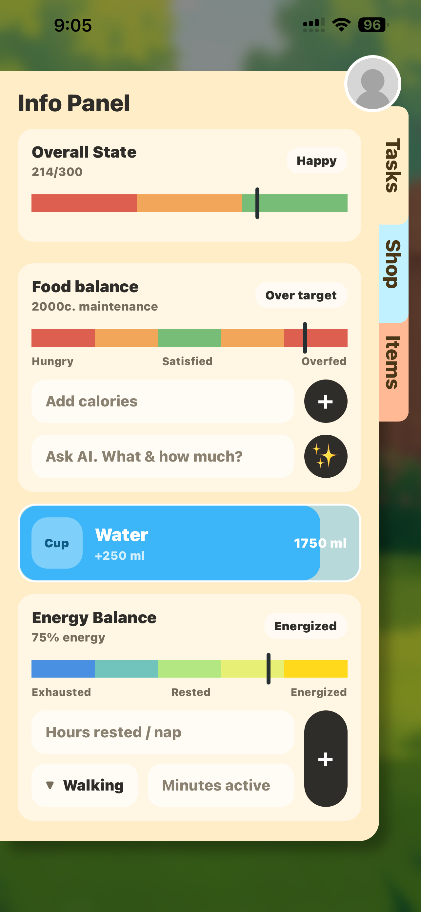
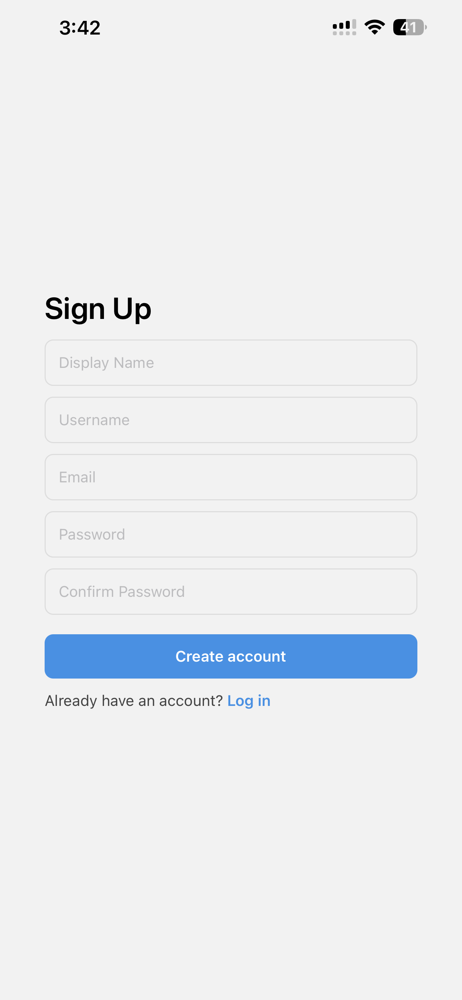

# 🐶 Furness

A full-stack mobile wellness application where taking care of yourself takes care of your virtual pet.

Furness transforms everyday healthy habits into a Tamagotchi-style experience. Logging meals, water intake, and sleep directly affects your pet's wellbeing, encouraging users to build healthier routines through gamification.

🎥 **Demo Video:** *https://youtube.com/shorts/WqnW-qGLUe4?feature=share*

---
## 📸 Screenshots

<table>
  <tr>
    <td align="center">
      <br>
      <b>Habitat</b>
    </td>
    <td align="center">
      <br>
      <b>Info Panel</b>
    </td>
  </tr>
  <tr>
    <td align="center">
      <br>
      <b>Login</b>
    </td>
    <td align="center">
      <br>
      <b>Sign Up</b>
    </td>
  </tr>
</table>

## Features

* 🔐 Secure user authentication with encrypted passwords
* 📧 Email verification and account creation
* 🐶 Virtual pet with real-time state changes
* 🍽️ Food, water, and sleep tracking
* ⏳ Time-based stat decay system for realistic gameplay
* 🤖 AI-powered meal analysis using the OpenAI API
* 💾 Automatic synchronization between local storage and a MySQL database
* 🌐 RESTful Express.js backend
* 🐳 Dockerized backend and MySQL database for one-command setup

---

## Tech Stack

**Frontend**

* React Native
* Expo
* TypeScript

**Backend**

* Node.js
* Express.js
* JWT Authentication
* bcrypt

**Database**

* MySQL

**Infrastructure**

* Docker
* Docker Compose

**AI**

* OpenAI API

---

## Running the Project

### Backend

Start the backend server and MySQL database using Docker:

```bash
docker compose up --build
```

### Frontend

```bash
npm install
npx expo start
```

Scan the generated QR code using **Expo Go**, or launch the project using an Android emulator or iOS simulator.

---

## Repository Workflow

Create a feature branch before making changes:

```bash
git checkout -b feature-name
```

Push your branch:

```bash
git push origin feature-name
```

Keep your branch up to date:

```bash
git pull origin main
```

---

## Future Improvements

* Interactive pet animations
* Pet customization
* Push notifications and reminders
* Cloud deployment
* Social features and leaderboards
